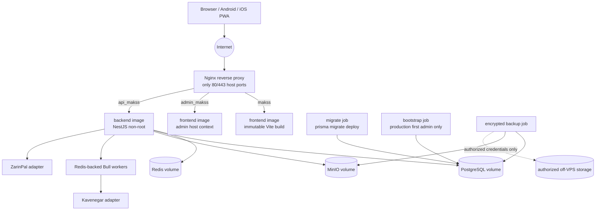
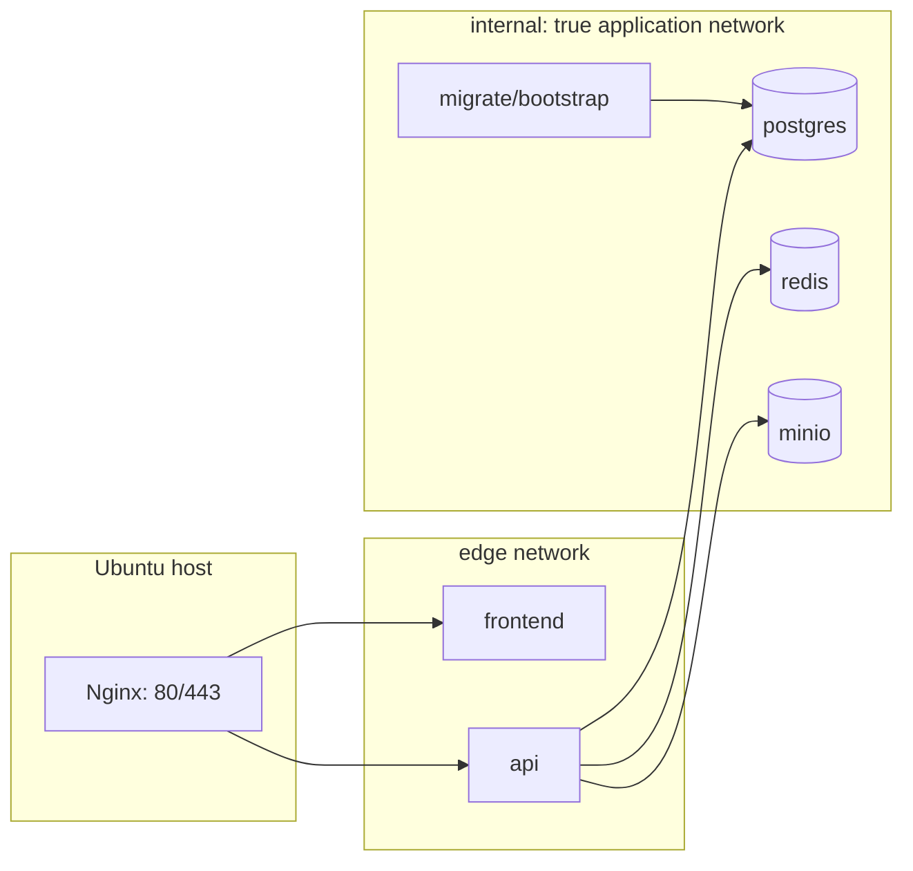

# Design Document: MEKSS Production Deployment

## Overview

MEKSS Production Deployment turns the repository into a reproducible, production-oriented delivery system for the React PWA and NestJS API. It defines a Compose-first topology that runs locally with safe mock integrations and deploys unchanged in structure to an authorized Ubuntu VPS. Nginx is the only public container and terminates TLS for `makss.ghaaar.ir`, `admin_makss.ghaaar.ir`, and `api_makss.ghaaar.ir`; PostgreSQL, Redis, and MinIO remain private to an internal Docker network.

The design intentionally separates **repository-deliverable artifacts** from **operator-authorized actions**. Compose files, Dockerfiles, validation scripts, Nginx templates, an environment schema/example, migration/seed jobs, CI checks, backup/restore scripts, and runbooks can be created and validated locally. DNS delegation, public firewall changes, certificate issuance/renewal against the live names, VPS deployment, off-VPS credential provisioning, and live Kavenegar/ZarinPal transactions require explicit Ubuntu VPS, DNS, storage, and provider authorization and will be reported as unexecuted until supplied.

### Goals

- Provide a single Compose model with a local development profile and a hardened production configuration.
- Build reproducible frontend and backend images without source-tree secrets or undeclared build inputs.
- Block API traffic until mandatory configuration, dependency health, and Prisma migrations succeed.
- Keep PostgreSQL, Redis, and object storage unexposed from the production host network.
- Deliver host-based HTTPS routing, exact-origin CORS, safe logs, auditable privileged operations, encrypted off-host backups, and a migration path to Coolify.
- Preserve the existing canonical Prisma role and ownership model while completing missing deployment boundaries.

### Non-goals and explicit operational boundary

- This design does not authorize deployment to a remote VPS, modify DNS, issue public certificates, upload backups to a third-party account, or send real SMS/payments.
- The existing `docker-compose.yml` is a development-oriented starting point, not a production manifest: it publishes data ports, uses insecure defaults, uses a mutable MinIO tag, and starts the API without a migration gate. It will be superseded by production-specific artifacts described here.
- Development sample data is never loaded by the production application. Production bootstrap creates only the explicitly configured first super administrator when none exists.

### Research findings informing the design

- Docker Compose starts dependencies in order but does not otherwise wait for readiness. Its documented `service_healthy` and `service_completed_successfully` conditions support the proposed dependency-health and one-shot migration gate ([Docker startup order](https://docs.docker.com/compose/how-tos/startup-order/)).
- Compose profiles selectively start auxiliary services while unprofiled core services remain enabled, supporting a local-only tooling/profile model without changing the production service graph ([Docker profiles](https://docs.docker.com/compose/profiles/)).
- Nginx `proxy_pass` supports forwarding API traffic to a named upstream and preserving the request URI when configured without a replacement URI; the proxy contract below uses that behavior with forwarded client/request metadata ([Nginx proxy module](https://nginx.org/en/docs/http/ngx_http_proxy_module.html)).

## Architecture

### Deployment topology



`frontend`, `api`, `migrate`, `bootstrap`, PostgreSQL, Redis, MinIO, and Nginx participate in the Compose stack. Nginx joins both the public-facing application network and the internal application network. The data services join **only** the internal network and have no `ports` mapping in the production override. Nginx is the only service with host mappings `80:80` and `443:443`; certificate material is mounted read-only from an operator-managed location and is never copied into an image.

### Compose artifacts and profiles

| Artifact | Responsibility | Local behavior | Production behavior |
|---|---|---|---|
| `compose.yaml` | Common service names, networks, health checks, volumes, non-secret environment references | Base graph; no production secrets | Base graph; composed with production override |
| `compose.local.yaml` | Developer port bindings, developer-friendly hostnames and named local volumes | Publishes API/UI and optional MinIO console ports; `SMS_PROVIDER=mock`, `PAYMENT_PROVIDER=mock` | Never used |
| `compose.production.yaml` | Hardened topology | Can be rendered and schema-validated locally | No data-service host ports, restart policies, read-only config mounts, Nginx public ports only |
| `profiles` | Optional one-off/support services | `tools` for Prisma Studio or MinIO console; `seed` for development seed; `backup-test` for isolated restore validation | Explicitly target `migrate`, `bootstrap`, or `backup`; never enable debug tooling |
| `.env.example` and environment schema | Non-secret key names, semantics, validation | Uses explicitly non-production mock/default-safe values | Supplies no values; an untracked `.env.production` or Docker secrets source is required |
| `ops/nginx/` | HTTP-to-HTTPS redirect and TLS virtual host templates | Uses local development certificates or an HTTP-only local override | Uses authorized certificates and real host names |

The production startup command is designed as an operator flow rather than a hidden side effect: render/validate configuration, build or pull images, start data dependencies, run `migrate` to completion, run `bootstrap` once, start API/frontend/Nginx, then execute readiness and host-routing checks. The API service declares `depends_on` conditions for database/Redis/MinIO health and successful completion of the migration service. Nginx declares an API readiness dependency and must return an upstream-unavailable response rather than forwarding traffic if API readiness has not passed.

### Image builds

#### Backend image

The backend uses a multi-stage Dockerfile pinned to the repository’s documented Node LTS version. The dependency/build stage copies only `package.json` and the lockfile before `npm ci`, then copies the source, runs `prisma generate`, and runs `npm run build`. The runtime stage copies only production dependencies, Prisma schema/migrations/client, and `dist`, executes as an unprivileged numeric UID, and uses an init process for signal forwarding.

The current Dockerfile already creates UID 1001, but it installs production-only dependencies in the build stage, which can omit build tooling. The replacement must install lockfile dependencies in the builder and production-only dependencies in the runtime stage. The runtime image must not include `.env*`, test output, host uploads, logs, certificate files, or build-cache directories. A `.dockerignore` enforces that boundary. Image metadata records source revision and immutable image version, not secrets.

#### Frontend image

The frontend has a separate multi-stage Vite build image. Its builder runs `npm ci` from the frontend lockfile, receives only non-secret build arguments such as the API base path (`/api` or `https://api_makss.ghaaar.ir`), produces `dist`, and copies that immutable output into a non-root Nginx static-server image. The frontend must not receive JWT signing keys, provider credentials, database URLs, or any secret at build time.

The PWA build integrates one service-worker generator (Vite PWA/Workbox-compatible) and emits exactly one manifest, registered service worker, and 192×192/512×512 icons. Runtime caching is restricted to versioned static assets and the anonymous offline shell. Requests with `Authorization`, authentication endpoints, and user-specific API responses bypass service-worker caching. Logout deletes browser-accessible private state and all private/scope-specific cache entries before rendering signed-out UI.

### Network and traffic model



Network aliases are stable service names (`postgres`, `redis`, `minio`, `api`, `frontend`) rather than host ports. Production database, Redis, and MinIO credentials are injected at container runtime through environment/secrets; application code connects over the internal network. Persistent named volumes are `postgres-data` and `minio-data`; Redis persistence is configured only as needed for durable queue semantics, and its append-only volume is retained across a controlled restart.

### Reverse proxy and TLS routing

Nginx owns three named TLS virtual hosts:

| Host | Upstream/behavior | Required controls |
|---|---|---|
| `makss.ghaaar.ir` | Serves the public PWA image; `try_files` falls back to the frontend entry document for application deep links | HSTS, `X-Content-Type-Options`, `X-Frame-Options`, `Referrer-Policy`, static cache policy, 60 requests/minute/IP with burst ≤20 |
| `admin_makss.ghaaar.ir` | Serves the same PWA asset image; injects/selects administrator host context from `window.location.host` | Same headers/rate limit; UI context never grants authorization |
| `api_makss.ghaaar.ir` | `proxy_pass http://api:3000` with `Host`, client address, forwarded scheme, request ID, and real IP headers | Same headers/rate limit, request-body limits, upstream timeouts, no proxy cache for authenticated/API responses |

Port 80 has a host-specific server block that redirects each known host to the same HTTPS host/path/query. An unknown host is rejected rather than served by an application default. TLS certificates and renewal configuration are operator-managed and mounted read-only; the repository provides templates and a renewal dry-run command only. Nginx must generate or forward a correlation/request ID and the API must return/log the same identifier.

The API enables credentialed CORS only for the exact two origins `https://makss.ghaaar.ir` and `https://admin_makss.ghaaar.ir`. It returns the exact approved origin, never `*`, and omits `Access-Control-Allow-Origin` for every other origin. The current `CORS_ORIGINS` handling provides a basis but requires production validation and an exact-origin integration test.

## Components and Interfaces

### 1. Configuration validation component

`validate-production-config` is a short-lived command executed before migration/API startup. It receives process environment variables and/or mounted Docker secret files and exits before any listener accepts traffic.

```ts
interface ConfigurationValidator {
  validate(input: Record<string, string | undefined>): ValidatedRuntimeConfig;
}

interface ValidatedRuntimeConfig {
  nodeEnv: 'production';
  databaseUrl: string;
  redisUrl: string;
  objectStorage: { endpoint: string; accessKey: Secret; secretKey: Secret; bucket: string };
  auth: { accessSecret: Secret; refreshSecret: Secret; accessTtl: '15m'; refreshTtl: '30d' };
  sms: { provider: 'mock' | 'kavenegar'; apiKey?: Secret; sender?: string; template?: string };
  payment: { provider: 'mock' | 'zarinpal'; merchantId?: Secret; callbackUrl: URL };
  corsOrigins: readonly ['https://makss.ghaaar.ir', 'https://admin_makss.ghaaar.ir'];
}
```

Required production keys include database/Redis/object-storage credentials, access and refresh signing secrets, CORS origins, public API URL, upload MIME/size policies, and provider-specific credentials when that provider is selected. The validator rejects missing values and case-insensitive placeholders (`changeme`, `change_me`, `replace-me`, `replace_with`, `example`, `placeholder`) and prints only key names. It treats mock providers as valid only when explicitly selected; it never silently falls back to mock behavior in production. Its environment example lists every key with inert marker values and is safe to commit.

### 2. Migration and initialization jobs

`migrate` is a one-shot image entrypoint running `prisma migrate deploy`. It waits for PostgreSQL health, uses the same `DATABASE_URL` as API, emits migration identifier/status records without credentials, and exits zero only when all committed migrations are recorded. A failure or five-minute timeout prevents API/Nginx traffic startup.

`bootstrap` runs after `migrate` and performs two mutually exclusive paths:

- **Development (`NODE_ENV=development`, explicit `seed` profile):** `prisma db seed` executes the existing idempotent seed. Stable unique keys such as `MEKSS-DEMO`, `MEKSS-DEMO-LICENSE`, and `DEMO-0001` prevent duplicate logical sample entities. A test verifies the documented record set after two executions.
- **Production:** an initialization command reads `SEED_ADMIN_PHONE`, `SEED_ADMIN_NAME`, and `SEED_ADMIN_PASSWORD` solely from environment/secrets. It uses a database transaction/unique identity lock to create exactly one `SUPER_ADMIN` only when no bootstrap super administrator exists, sets `mustChangePassword=true`, and writes an audit record with actor `system-bootstrap`, target ID, UTC timestamp, and success result. It never prints or persists the plaintext password. Re-execution is a no-op; it never transforms normal seed behavior into production demo data.

The API enforces a `mustChangePassword` session guard so a bootstrap administrator can only change password until successful completion. Public registration ignores/rejects privileged roles, creates only unapproved/non-privileged accounts, and returns 403 for elevation attempts.

### 3. API runtime, health, logging, and audit interfaces

The NestJS API exposes two non-authenticated operational endpoints behind Nginx:

```ts
type DependencyName = 'database' | 'redis' | 'objectStorage';
interface ReadinessResponse {
  status: 'ready' | 'not_ready';
  dependencies: Record<DependencyName, 'up' | 'down'>;
  correlationId: string;
  checkedAt: string; // UTC ISO-8601
}
// GET /health/live -> 200 when event loop/process is alive
// GET /health/ready -> 200 when all dependencies are up; 503 otherwise
```

Each ready check applies a bounded individual dependency probe and returns within five seconds. It reports every failed dependency but no connection string or credential. Compose uses `/health/ready`; liveness only determines whether an otherwise initialized process remains alive.

Every API request receives or generates `X-Request-ID`/Correlation_Identifier, passes it through structured JSON logs, audit events, and proxied responses. The redaction layer removes configuration secrets, headers/tokens, OTPs, payment credentials, and phone digits except the last four. The existing SMS gateway’s masking and mock behavior are a starting point but must be normalized to the last-four-digits requirement and must never log an OTP, including in development CI output.

`AuditService.append` participates in the database transaction for privileged and business-state-changing mutations. If audit persistence fails, the domain mutation rolls back and returns 500. Audit records have actor (or `system-bootstrap`), action, target type/id, UTC timestamp, result, and safely bounded structured change metadata; they remain append-only.

### 4. Identity, authorization, and API contract component

The API remains the sole authorization authority. Its versioned `/api/v1` OpenAPI document and DTOs define the contracts for factories, gate passes, invoices, requests, announcements, advertisements, emergencies, analytics, authentication, user management, and file operations. The frontend client is generated or contract-tested against those methods, paths, status codes, validation representation, pagination shape, and response fields.

Authorization is evaluated in the order: authenticate access token, reject disabled/password-change-restricted state, evaluate required role, then constrain the query/mutation by tenant scope. Scope derives from canonical Prisma ownership relations (`IndustrialPark`, `Factory`, manager/owner links) rather than client-supplied IDs. A forbidden cross-tenant request returns 403 with no resource representation. Collections always include declared page, page size, and total record count after scope filtering.

OTP records and refresh-token hashes remain in PostgreSQL, making single-use/attempt limits/revocation durable across API restart. OTP issuance uses a six-digit value, hashes it, sets five-minute expiry, and enforces five-invalid-attempt lockout per identity for 15 minutes. Access tokens last 15 minutes. Refresh rotation atomically creates one replacement token, revokes the presented token, and commits revocation before returning 200; logout and user disable revoke relevant unexpired tokens before returning success.

### 5. External-service adapter interfaces

Provider calls are isolated behind interfaces selected once at startup from explicit provider mode:

```ts
interface SmsAdapter {
  sendOtp(input: { destination: string; code: string; correlationId: string }): Promise<DeliveryReceipt>;
  sendNotification(input: NotificationPayload): Promise<DeliveryReceipt>;
}
interface PaymentAdapter {
  initiate(input: EligibleInvoicePayment): Promise<{ authority: string; redirectUrl: string }>;
  verify(authority: string, amount: string): Promise<VerificationResult>;
}
interface ObjectStorageAdapter {
  check(): Promise<'up'>;
  putScoped(input: ScopedUpload): Promise<{ key: string }>;
  createReadUrl(input: { key: string; expiresInSeconds: number }): Promise<string>;
}
```

`mock` adapters make no network calls and return deterministic configured responses suitable for local/CI tests. `kavenegar` and `zarinpal` adapters validate all provider credentials at startup and map provider outcomes into typed retryable/non-retryable errors without logging secrets or unmasked recipients. Production provider mode requires authorized credentials; selecting it without them fails configuration validation. Provider sandbox/live transaction verification is explicitly deferred until authorization is available.

For payment initiation, the API persists a `PaymentTransaction` in `INITIATED` state with unique `authority` and idempotency key before returning the provider redirect. Callback verification finds only a persisted pending/verified authority; it verifies pending records, then transactionally writes the single verified result and marks the invoice `PAID`. A duplicate verified callback returns the original verified result without a second payment or state change. Verification failure records `FAILED` while retaining invoice `PENDING`; unknown authority returns 404 with no mutation. PostgreSQL durability ensures restart-safe pending processing.

Notifications are dispatched by Redis-backed Bull workers. Retryable errors schedule no more than three retries at 60, 300, and 900 seconds. Terminal retryable and immediate non-retryable failures persist notification ID, provider error code, UTC timestamp, and terminal status. Success similarly persists an outcome. The worker design must replace the current generic fixed-backoff queue settings with exact per-attempt delays and outcome persistence.

### 6. Private object storage interface

All object keys follow `tenants/{parkId}/factories/{factoryId}/{domain}/{objectId}` or an equivalent canonical scoped prefix. API upload logic checks allowed MIME type and byte count before calling storage; failed checks return 400 and never create an object. Bucket policy is private. Authorized retrieval confirms tenant scope before requesting a presigned GET URL capped at 900 seconds; rejected scope returns 403 without URL. The MinIO/S3 adapter handles expired URLs as access denials. The current 24-hour presign behavior and fallback `minioadmin` credentials are replaced.

### 7. Frontend interaction interface

The frontend determines API base URL from non-secret build-time public configuration and determines public/admin experience from the actual host name. It does not infer roles from host context: it requests the authenticated profile and renders only permitted navigation/dashboards. Every supported endpoint has an explicit loading state after 300 ms, retryable error state, and distinct empty state. Persian UI uses RTL direction and Persian numerical formatting. Responsive tests cover 360, 768, and 1440 CSS-pixel widths without document horizontal overflow or loss of primary actions.

Android Chrome receives an install prompt/control when eligible; iOS Safari receives explicit Share → Add to Home Screen instructions. When previously installed, offline launch serves the app shell within five seconds. On an installed update, the client shows an update notice before `skipWaiting`/activation so users control interruption.

## Data Models

The canonical persisted model remains Prisma/PostgreSQL; deployment work adds migration-managed fields/tables rather than out-of-band schemas. Existing `Role`, `User`, `IndustrialPark`, `Factory`, `Invoice`, `PaymentTransaction`, `RefreshToken`, `OtpChallenge`, `Notification`, and `AuditLog` provide the baseline. Migrations must be versioned and committed, and `prisma migrate deploy` is the only production schema writer.

| Model / artifact | Required deployment-aligned state and invariants |
|---|---|
| `_prisma_migrations` | Prisma-owned ordered history. `migrate` applies absent committed migrations once; successful rerun leaves schema/history unchanged. |
| `User` | Canonical role enum, approval/activity state, `mustChangePassword`, and unique identity; public registration cannot create privileged/approved users. Bootstrap identity has a uniqueness constraint appropriate to the selected identity. |
| `RefreshToken` | Hash only; `expiresAt`, nullable `revokedAt`, user relation, and indexes for active token revocation. Rotation/revocation durable in PostgreSQL. |
| `OtpChallenge` | Hashed code, purpose, expiry, attempt count, consumed time, and identity index to enforce one use and attempt lockout. |
| `PaymentTransaction` | Unique `authority` and `idempotencyKey`, invoice relation, `INITIATED`/`VERIFIED`/`FAILED` state, provider data sanitized for persistence, result/ref ID, and verified timestamp. Unique authority plus transaction prevents duplicate verified rows. |
| `NotificationDelivery` (new migration) | Notification/job ID, channel/provider, state (`PENDING`, `SUCCEEDED`, `FAILED`), attempt number, final provider error code, correlation ID, and UTC terminal timestamp; supports retry/audit evidence without depending on ephemeral Redis jobs. |
| `AuditLog` | Append-only actor/action/entity/entity ID/change summary/result/correlation ID/UTC timestamp. Bootstrap uses `system-bootstrap` actor representation without secret fields. |
| File metadata (new or existing domain relation) | Object key, tenant/factory scope, original file metadata, MIME/bytes, uploader, and creation timestamp. Never store a durable presigned URL. |
| `BackupManifest` (off-stack manifest or controlled operations store) | Backup ID, completion time, retention expiration (≥30 days), offsite location identifier, encrypted archive/object manifest checksum, integrity result, and restore-drill result. No storage credential. |
| Volumes | `postgres-data`, `minio-data`, and optionally durable `redis-data`. Redeploy/restart preserves them unless an explicit destructive operation is run. |

Backup jobs create a consistent PostgreSQL dump and an object-storage manifest/data archive, encrypt each artifact with an operator-supplied encryption key, verify integrity before offsite upload, and record the manifest. Scheduling runs at least every 24 hours and retains successful artifacts for at least 30 days. A quarterly (90-calendar-day) isolated restore drill reconstructs PostgreSQL and object storage from the latest successful backup, checks database queryability and compares restored object count to the manifest. All remote storage configuration, encryption-key custody, and actual scheduled execution require authorized infrastructure; local CI validates archive/restore logic against an isolated local target only.

## Correctness Properties

Randomized test generation remains **non-primary** for this feature. The behavior is predominantly deployment/IaC configuration, container orchestration, reverse-proxy policy, external-service integration, browser rendering, and operator-run procedures. Those concerns are better verified with deterministic configuration, image, and integration checks than with randomized execution. The following executable invariant records the deployment boundary that the Acceptance Suite must enforce.

### Property 1: Production images exclude repository secrets and run unprivileged

For every production image built from a clean repository revision using `compose.yaml` and `compose.production.yaml`, the image filesystem and image configuration SHALL contain no `.env` files, TLS private keys, provider credentials, database URLs, JWT/refresh secrets, OTP values, or source-tree upload/log artifacts; the configured runtime user SHALL be a non-root numeric UID. The check SHALL fail if any prohibited path, configured environment value, or known synthetic secret sentinel is present, or if the effective runtime user is root.

**Validates: Requirements 13, 15, 18**

**Deterministic validation strategy.** The Acceptance Suite will build each production image from a clean disposable build context, render the production Compose configuration with synthetic non-placeholder secrets, and inspect both image metadata and filesystem layers. It will scan for prohibited filenames and a unique test-only secret sentinel deliberately supplied outside the build context; it will assert that the sentinel is absent, that `.env*`, certificate/private-key, upload, and log paths are absent, and that `Config.User` resolves to a non-root numeric UID. A negative fixture that intentionally copies the sentinel or sets `USER root` must make the check fail, proving the validator detects a violated invariant. This is a deterministic test, not a randomized property-based test.

The remaining deterministic equivalents are mandatory and provide the required evidence without overstating what has run:

- **Configuration and image boundaries:** environment-schema/placeholder validation, `docker compose config`, Dockerfile and `.dockerignore` checks, image inspection for non-root execution, and secret/log scans.
- **Topology and traffic admission:** disposable-Compose tests for dependency health, migration completion gates, `/health/ready` behavior, private data-service networking, persistent volumes, and only Nginx host-port exposure.
- **Proxy and client behavior:** `nginx -t`, local container routing tests for HTTPS redirects, known-host rejection, deep-link fallback, forwarded request IDs, security headers, exact-origin CORS, rate-limit configuration, and browser/PWA tests for the defined offline and cache boundaries.
- **Stateful operational logic:** deterministic Prisma/API/adapter tests for idempotent migration and bootstrap behavior, transaction/audit rollback, authentication and tenant-scope enforcement, payment callback idempotency, retry scheduling, scoped object URLs, and isolated local backup/restore checksum and manifest verification.
- **Authorization-dependent operations:** Ubuntu deployment, DNS, public TLS, provider delivery/payment, and actual off-VPS backup execution remain explicitly **unexecuted** until the required VPS, DNS, provider, storage, and credential authorization is supplied. They are represented by runbook steps and the evidence ledger, not synthetic claims of completion.

## Error Handling

Errors are classified at the layer that can give the operator or client a safe, actionable outcome. All error responses and logs include a correlation ID, use the published API error representation where applicable, and never expose secrets, provider raw credentials, tokens, OTPs, or database connection strings.

| Condition | Behavior | Observable evidence |
|---|---|---|
| Required production configuration missing/placeholder | `validate-production-config` exits non-zero before migration/API/Nginx application traffic; prints key names only | Command report identifies missing/invalid key names, exit code |
| Database/Redis/MinIO unavailable at startup | Dependency health check blocks dependent job/API; readiness returns 503 within five seconds and lists each unavailable dependency | Compose health status, readiness JSON, correlation-linked structured logs |
| Migration error or >300 seconds | `migrate` exits non-zero with migration ID/timeout; API is never marked ready and Nginx cannot forward successful application traffic | Migration service log and failed acceptance check |
| Production bootstrap conflict/re-run | Transaction/unique identity guarantees one account; re-run records no duplicate or password content | Bootstrap result and audit record; database uniqueness verification |
| Invalid API DTO | API returns 400 with at least one field-specific published validation error | Contract/integration test report |
| Unauthenticated/unauthorized/cross-tenant request | API returns 401 or 403; cross-tenant error contains no resource fields and produces no success audit record | Security integration report |
| OTP invalid, expired, consumed, or rate-limited | API returns 401 and persists/uses lockout state; no credential is issued | Authentication test and database state assertion |
| Refresh token expired/revoked | API returns 401 without a replacement; restart does not erase revocation | Restart integration report |
| Audit persistence failure | Enclosing privileged/business mutation rolls back and returns 500 | Transactional failure integration test |
| Provider configuration invalid/unavailable | Provider mode fails configuration validation if keys absent; transient request/response errors map to retryable/non-retryable typed outcomes without secret leakage | Adapter unit tests, mocked integration logs |
| Payment verification failure/unknown/repeated callback | Record `FAILED` and retain unpaid invoice; return 404 with no mutation for unknown authority; return original verified result for duplicate callback | Payment state-transition tests |
| Notification retryable failure | Queue schedules exactly 60/300/900-second retry delays; terminal failure persists an outcome after third retry | Deterministic queue/clock test |
| Upload MIME/size/scope violation | Return 400 or 403 before storage write/URL issuance | Storage adapter and API tests |
| Expired signed URL | Object store denies access; API never extends URL beyond 900 seconds | MinIO integration test |
| PWA offline/update/cache problem | Offline fallback is anonymous shell only; user is offered update before activation; private data/cache deletion completes on logout | Browser/PWA test report |
| Backup checksum/upload/restore failure | Manifest records failed integrity status; operator alert path identifies backup ID within 15 minutes; failed artifact is not marked successful | Local restore-drill report; remote alert execution marked unexecuted when unauthorized |
| Unknown HTTP host or insecure request | Unknown host is rejected; known hosts redirect to identical HTTPS host/path/query | Nginx configuration and container smoke test |

Failure handling distinguishes non-secret diagnostic data (service name, migration identifier, backup ID, correlation ID, provider status category) from secret data (values, headers, full phone numbers, OTPs, refresh tokens, payment credentials). Redaction occurs before output reaches application logs, container logs, or CI artifacts.

## Testing Strategy

### Testing applicability

This feature is principally deployment configuration, container topology, external-service integration, UI rendering, and operational procedures. These behaviors are evaluated more reliably through schema/configuration validation, deterministic unit tests, Compose integration smoke tests, browser/PWA tests, and controlled restore drills than through randomized property testing. The **Correctness Properties** section records this non-applicability and the deterministic equivalent validations. Where later implementation extracts pure logic—for example placeholder detection, tenant-key construction, or provider-result classification—those units may add property tests in their own implementation design, but they are not a requirement of this deployment design.

### Test layers and acceptance matrix

| Layer | Test scope | Primary requirements |
|---|---|---|
| Static validation | JSON/YAML syntax, `docker compose config`, Dockerfile lint, Nginx `nginx -t`, environment-schema validation, `.dockerignore`/secret scan | 1, 13, 14, 15, 18 |
| Backend unit tests | Configuration validator, redaction/masking, OTP/token state transitions, role/scope policy, audit transaction behavior, payment idempotency decision logic, notification retry schedule, scoped object-key/TTL validation | 2–9, 12, 15 |
| Prisma integration tests | Empty-schema migration, repeated migration no-op, seed idempotence, production bootstrap exact-once/audit, refresh durability/revocation after restart, payment transaction atomicity | 2–7, 12, 18 |
| API contract/integration tests | OpenAPI/DTO contract, success, invalid input, 401, 403, cross-tenant no-data for every business domain; CORS allowed/denied; readiness dependency failures | 2–10, 12, 14, 18 |
| Adapter/queue integration tests | Mock SMS and payment network isolation, deterministic mock receipts, Kavenegar/ZarinPal error mapping, exact 60/300/900 delays, terminal outcome persistence | 7–8, 15, 18 |
| Storage integration tests | Allowed/rejected upload, tenant keying, 900-second-or-less signed URL, forbidden scope, expired URL denial | 9, 12, 18 |
| Frontend/browser tests | Role-aware navigation, loading/error/empty states, RTL/Persian formatting, responsive 360/768/1440 behavior, host-aware admin context, PWA manifest/service worker/offline/logout/cache/install/update flows | 6, 10–11, 18 |
| Compose smoke tests | Clean image build, non-root image inspection, migration traffic gate, dependency readiness, internal network/no data ports, persistent PostgreSQL/MinIO volumes after restart, secret-free logs | 1, 2, 3, 13, 15, 18 |
| Nginx container tests | HTTP redirect, three-host routing, deep-link fallback, API proxy/header forwarding, security headers, CORS, rate-limit configuration | 14, 18 |
| Backup/restore drill | Encrypted archive creation, manifest/checksum, isolated restore query/object-count comparison, retention/schedule configuration | 16–18 |
| Authorized operational checks | VPS provisioning, DNS resolution, actual certificate issuance/renewal, real provider sandbox/live transactions, off-VPS storage upload and scheduled restoration | 14, 16–18; only after authorization |

The Acceptance Suite runs from a clean checkout and records command, timestamp, exit status, image revision, and failed-check name. It must run non-mutating lint (the current backend `lint` script uses `--fix` and must be replaced or complemented by a check-only command), backend/frontend type checks, frontend/backend production builds, Prisma migration validation, unit/integration/browser tests, Compose build/smoke, and secret scans. A failed required check returns non-zero and preserves sanitized diagnostic artifacts.

Representative non-interactive commands to be implemented in scripts/CI are:

```text
npm ci && npm run typecheck && npm run lint:check && npm test -- --runInBand
npm ci && npm run typecheck && npm run lint:check && npm run build
prisma migrate deploy
prisma db seed                         # development/seed profile only
docker compose -f compose.yaml -f compose.production.yaml config
docker compose -f compose.yaml -f compose.production.yaml build
docker compose -f compose.yaml -f compose.local.yaml up --wait
nginx -t
```

Tests use disposable Compose project names, temporary volumes, mock adapters, and isolated databases/buckets. They do not invoke a real VPS, public DNS API, TLS CA, Kavenegar, ZarinPal, or offsite production backup account. Production configuration validation runs with synthetic non-placeholder secrets that are generated for the test process and never emitted.

### Local evidence versus authorization-dependent evidence

The release report is a versioned machine-readable and human-readable artifact with this ledger:

| Evidence item | Can be produced locally now? | State without authorized access |
|---|---:|---|
| Image build, migration gate, readiness, internal networking, persistence, secret/log scan | Yes | Executed with command/output/exit status |
| Nginx syntax, local HTTP routing, deep-link fallback, headers/rate-limit configuration | Yes | Executed against local Compose hostnames/certificates |
| Mock OTP/payment/queue workflows and PWA browser checks | Yes | Executed with mock adapters |
| Production env-key completeness/placeholder rejection | Yes | Executed with synthetic values only |
| Ubuntu host provisioning/firewall, remote Compose deployment | No | **Unexecuted — authorized Ubuntu VPS access required** |
| DNS records for the three production hosts | No | **Unexecuted — DNS authority required** |
| Public TLS issuance/renewal dry run against production domains | No | **Unexecuted — VPS/DNS authority required** |
| Kavenegar/ZarinPal sandbox or live delivery/payment | No | **Unexecuted — provider credentials/authorization required** |
| Encrypted upload to a real off-VPS destination and scheduled restore drill | No | **Unexecuted — off-VPS storage and encryption-key authorization required** |

This distinction is mandatory: the suite may confirm configuration readiness but must never claim an external operation occurred if authorization was unavailable.

### Future Coolify mapping

Coolify migration reuses the same immutable frontend/backend images, runtime-only environment/secrets, health endpoints, and persistent data boundaries; it does not introduce a different application topology.

| Compose concept | Coolify mapping | Migration/rollback requirement |
|---|---|---|
| Frontend/API images | Two Coolify services from the same revision-tagged images or repository builds | Deploy API only after migration success; pin prior image digest for rollback |
| Nginx virtual hosts/TLS | Coolify proxy/domain configuration for all three hosts; application proxy only when its capabilities preserve required headers/rate limit | Revalidate deep links, exact CORS, security headers, rate limit, and TLS after cutover |
| `postgres-data`, `minio-data`, `redis-data` | Named persistent volumes or managed equivalents, never ephemeral mounts | Snapshot/backup before cutover; map paths/ownership and verify restoration before traffic switch |
| `migrate`/`bootstrap` one-shots | Pre-deploy command/job with logs and failure gate; bootstrap is idempotent | Do not promote API revision when migration fails; rollback code only after confirming schema compatibility/restore plan |
| Runtime configuration | Coolify encrypted environment/secret variables, not build args | Enter all required keys, validate no placeholders, rotate post-migration if needed |
| Health checks | `/health/live` for process liveness and `/health/ready` for traffic admission | Coolify traffic must wait for readiness; verify dependency availability |
| Backup/restore | Scheduled job or external scheduler using same backup image/script | Preserve offsite target, retention metadata, encryption-key access, and 90-day restore drill |

The Coolify runbook first inventories current Compose image tags, environment key names (never values), volumes, database/MinIO checksums, host mappings, and current backup. It provisions matching volumes/secrets/domains, runs migration against a verified backup/snapshot, starts services without public cutover, executes readiness and smoke tests, switches routes only after success, and retains the prior Compose deployment and backup until post-cutover validation completes. Rollback switches traffic to the prior compatible image and, if a non-backward-compatible migration was applied, restores the verified pre-cutover backup into the isolated/approved recovery path rather than attempting unsafe schema reversal.

### Design validation and requirement traceability

The design will be considered implemented only when the Acceptance Suite provides evidence for all requirement groups: reproducible startup/readiness (1); migrations and tenant scoping (2); idempotent development seed/secure bootstrap (3); durable authentication/authorization (4–5); versioned contract/client alignment (6); restart-safe mock/provider payment and notification flows (7–8); private scoped files (9); role-aware responsive PWA and secure install/offline behavior (10–11); health/log/audit safeguards (12); hardened images, migration gating, network isolation, environment validation, persistence (13, 15); Nginx/TLS/CORS/rate-limit configuration (14); encrypted backup/restore reporting (16); runbooks/Coolify/redeploy preservation and authorization ledger (17); and clean-checkout CI reporting/failure behavior (18).

If a requirement gap is discovered during implementation—for example a needed distinction between Park and Factory tenant scope, a provider callback contract detail, or an offsite backup destination—the workflow should return to requirements clarification before changing the design or claiming acceptance.
