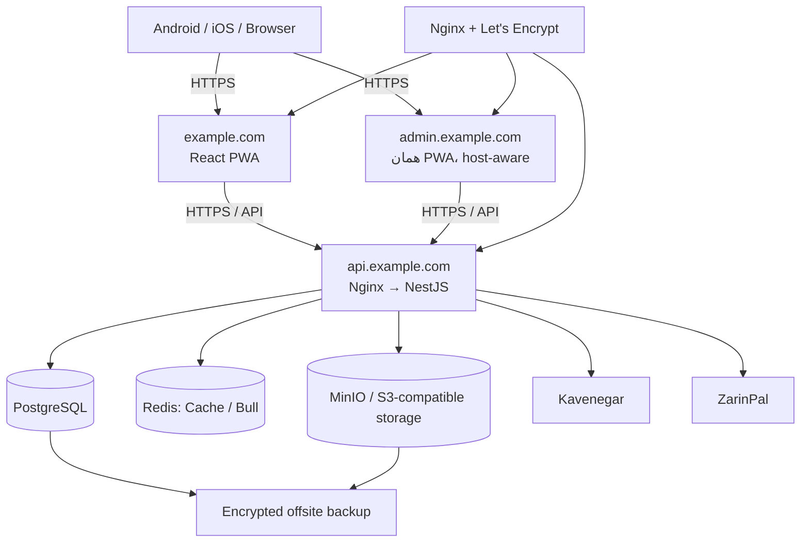

# برنامهٔ عملیاتی‌سازی و آماده‌سازی Production سامانه MEKSS

**وضعیت:** مصوب برای اجرا  
**تاریخ:** 2026-08-17  
**هدف:** تبدیل repository فعلی به یک سامانهٔ قابل‌اجرا، امن، قابل‌آزمون و قابل‌استقرار در production؛ نه صرفاً تکمیل مستندات.

## نیازمندی‌های تثبیت‌شده

- همهٔ ماژول‌ها، APIها، RBAC، پنل ادمین، SMS، پرداخت، صف، cache، فایل، PWA و گزارش‌ها باید واقعاً کار کرده و تست شوند.
- کلیدها و تنظیمات سرویس‌های بیرونی فقط از `.env` یا Docker secrets خوانده می‌شوند. محیط development/test باید adapter mock داشته باشد.
- Prisma migrationهای versioned، دادهٔ توسعه و Super Admin امن باید ایجاد شوند.
- استقرار نخست با Docker Compose و Nginx روی Ubuntu است؛ معماری باید بدون تغییر بنیادی قابل انتقال به Coolify باشد.
- دامنه‌ها: `example.com` برای PWA، `admin.example.com` برای همان PWA با تجربهٔ host-aware ادمین، و `api.example.com` برای API.
- backup رمزگذاری‌شده و خارج از VPS، همراه با runbook بازیابی و restore drill لازم است.
- PWA باید در Android و iOS قابل نصب، standalone، امن و قابل به‌روزرسانی باشد.
- API key یا Merchant ID هرگز در Git، image، log یا chat ثبت نمی‌شود. تنظیمات غیرحساس Kavenegar و ZarinPal از env خوانده می‌شوند.

## معماری هدف

### اصول طراحی

1. RBAC و tenant/park/factory scoping در API قطعی است؛ UI فقط تجربهٔ کاربر را محدود می‌کند.
2. DTO، OpenAPI، تست integration و client فرانت‌اند باید یک قرارداد واحد داشته باشند.
3. OTP، refresh token، payment authority و audit log در storage پایدار نگهداری می‌شوند.
4. mock فقط برای development/test است. production باید وضعیت سرویس‌های خارجی را با readiness روشن گزارش کند.
5. هیچ secret پیش‌فرضی در production مجاز نیست.

## تسک‌ها و معیار پذیرش

### 1. Baseline و قراردادهای واقعی سیستم
- **هدف:** فهرست قابل سنجش endpointها، نقش‌ها، مدل‌ها، وابستگی‌ها و تست‌ها ایجاد شود.
- **اجرا:** dependency manifestها، lockfile، API route/DTO/guard/client matrix و role model canonical همگام شوند.
- **پذیرش:** typecheck، lint بدون auto-fix و build قابل اجرا باشد؛ ناسازگاری‌های contract مستند و رفع شوند.

### 2. Prisma schema و migrationهای versioned
- **هدف:** دیتامدل سازگار و قابل استقرار تکرارشونده باشد.
- **اجرا:** enumها، relationها، indexها و tenant scope همگام شوند؛ migrationهای versioned ایجاد شوند؛ development و production migration path جدا باشد.
- **پذیرش:** PostgreSQL خالی با `migrate deploy` ساخته شود و اجرای دوبارهٔ migration بدون خطا باشد.

### 3. Seed توسعه و bootstrap امن Super Admin
- **هدف:** دادهٔ نمونه و اولین ادمین بدون privilege escalation فراهم شود.
- **اجرا:** seed idempotent برای دادهٔ توسعه؛ bootstrap production فقط با `SEED_ADMIN_*`؛ public registration بدون role ممتاز یا approval خودکار.
- **پذیرش:** seed دوبار duplicate نسازد؛ ساخت Super Admin توسط کاربر ناشناس رد شود؛ تغییر رمز نخستین ورود قابل آزمون باشد.

### 4. Authentication، OTP، refresh-token و RBAC
- **هدف:** ورود امن و پایدار برای تمام نقش‌ها.
- **اجرا:** OTP و refresh token پایدار و قابل revoke/rotation؛ adapter SMS mock/real؛ guardهای role و scope؛ frontend role-aware.
- **پذیرش:** login، OTP معتبر/منقضی، refresh پس از restart، logout، reset password و منع دسترسی cross-tenant تست شوند.

### 5. مدیریت کاربران و پنل Super Admin
- **هدف:** مدیریت واقعی کاربران، نقش، approval و تخصیص پارک/کارخانه.
- **اجرا:** endpointهای محدود و audit شده؛ admin host-aware در همان PWA؛ server مرجع مجوز.
- **پذیرش:** Super Admin بتواند کاربر بسازد، تأیید کند، نقش بدهد و audit record ایجاد شود.

### 6. قرارداد API و ماژول‌های کسب‌وکار
- **هدف:** Factory، Gate Pass، Invoice، Request، Announcement، Advertisement، Emergency و Analytics با client هم‌راستا و عملیاتی باشند.
- **اجرا:** prefix/version یکسان، DTO validation، error model استاندارد، pagination و ownership policy.
- **پذیرش:** happy path، validation، unauthorized، forbidden و cross-tenant برای هر API تست شوند.

### 7. پرداخت زرین‌پال پایدار و idempotent
- **هدف:** پرداخت invoice از request تا callback/verify قابل اتکا باشد.
- **اجرا:** adapter Sandbox/Production با env؛ state/payment authority پایدار؛ callback عمومی ولی verify شده؛ transitionهای invoice کنترل‌شده.
- **پذیرش:** callback تکراری، شکست پرداخت و restart بین request/verify تست شوند.

### 8. Kavenegar، Bull و notification
- **هدف:** SMS و notification با retry، مشاهده‌پذیری و mock قابل اعتماد باشند.
- **اجرا:** queue registration کامل، backoff/dead-letter، mask کردن شماره در log و notification پایدار درون‌برنامه‌ای.
- **پذیرش:** success، timeout، retry و failure provider تست شوند.

### 9. ذخیره‌سازی فایل و MinIO
- **هدف:** فایل‌ها private، validate شده و با URL محدود در زمان باشند.
- **اجرا:** allow-list نوع/اندازه، presigned URL، lifecycle و منع cross-tenant.
- **پذیرش:** upload/download مجاز، نوع نامجاز، URL منقضی و scope غیرمجاز تست شوند.

### 10. داشبوردها، RTL و تجربهٔ role-aware
- **هدف:** داشبوردهای پنج نقش از API واقعی استفاده کنند و در گوشی/دسکتاپ قابل استفاده باشند.
- **اجرا:** حذف mockهای غیرضروری، stateهای loading/error/empty، RTL، Persian formatting، accessibility و responsive layout.
- **پذیرش:** role guard UI و viewportهای mobile/tablet/desktop بررسی شوند.

### 11. PWA امن برای Android و iOS
- **هدف:** PWA قابل نصب، standalone و بدون cache دادهٔ خصوصی باشد.
- **اجرا:** تنها یک Workbox/VitePWA service worker، iconهای واقعی، offline fallback، update prompt و push فقط با VAPID/backend آماده.
- **پذیرش:** manifest، offline shell، logout cache clearing و نصب دستی Android Chrome/iOS Safari بررسی شوند.

### 12. Health، logging، audit و observability
- **هدف:** liveness/readiness، log امن، audit و metrics قابل استفاده باشند.
- **اجرا:** dependency health، structured logging با redaction، correlation ID و audit mutationها؛ Swagger production محدود شود.
- **پذیرش:** قطع dependency readiness را fail کند و secrets در log ظاهر نشوند.

### 13. Docker imageها و Compose production-safe
- **هدف:** imageهای reproducible برای backend/frontend و topology شبکهٔ امن ایجاد شود.
- **اجرا:** multi-stage build، non-root runtime، healthcheck واقعی، serviceهای data روی internal network، migration job و versionهای pinned.
- **پذیرش:** clone تمیز با Compose build/up شود، data پس از restart بماند و secret scan تمیز باشد.

### 14. Nginx، TLS و سه دامنه
- **هدف:** `example.com`، `admin.example.com` و `api.example.com` با HTTPS، routing و CORS صحیح منتشر شوند.
- **اجرا:** virtual host، Let’s Encrypt renewal، redirect، security header، SPA fallback، proxy و rate limit.
- **پذیرش:** HTTPS، deep-link، API proxy، CORS allowed/denied و renewal dry-run بررسی شوند.

### 15. Backup، restore و runbook عملیات
- **هدف:** PostgreSQL و object storage با backup رمزگذاری‌شده خارج از VPS قابل بازیابی باشند.
- **اجرا:** scheduled backup، retention، checksum، alert، least privilege و runbook restore/rollback/secret rotation.
- **پذیرش:** restore drill در محیط ایزوله و validation داده/فایل موفق باشد.

### 16. تست جامع و CI
- **هدف:** pipeline هر دو پروژه build، test و container smoke را تکرارپذیر اجرا کند.
- **اجرا:** unit/integration/E2E/PWA/Docker test، lint بدون `--fix`، dependency/image scan و migration check.
- **پذیرش:** pipeline روی clone تمیز سبز شود و role/business flowهای اصلی را پوشش دهد.

### 17. استقرار Ubuntu و مهاجرت Coolify
- **هدف:** اپراتور با `.env`، DNS و دستورهای مستند بتواند سیستم را deploy و بعداً به Coolify منتقل کند.
- **اجرا:** env example، VPS/DNS/firewall checklist، Compose/Nginx guide، bootstrap/migration/backup/rollback و راهنمای Coolify.
- **پذیرش:** fresh-server acceptance، DNS/TLS smoke، redeploy بدون data loss و backup verification موفق باشد.

## Definition of Done

- تمام buildها، تست‌های هدفمند و healthcheckهای محلی سبز هستند.
- migration و seed از PostgreSQL خالی قابل اجرا هستند.
- هیچ secret پیش‌فرض یا حساس در Git/image/log وجود ندارد.
- frontend، admin host و API با Docker Compose به‌صورت عملیاتی بالا می‌آیند.
- runbook Ubuntu و مسیر مهاجرت Coolify همراه با backup/restore مستند هستند.
- اتصال حقیقی Kavenegar و ZarinPal پس از قراردادن کلیدها و انجام Sandbox verification تأیید می‌شود.
